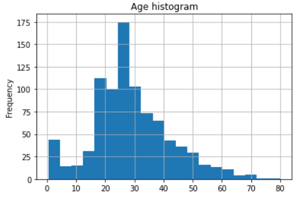
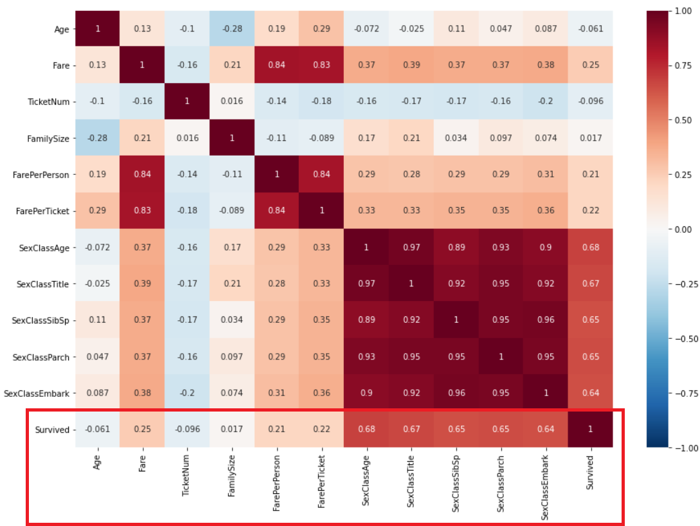

# Kaggle-Titanic
## Define problem
This project solves the iconic [Kaggle competition: Titanic](https://www.kaggle.com/c/titanic). Given the Titanic passengers' boarding information such as cabin number, family size, ticket price, and etc., use machine learning to create a model that predicts which passengers survived the Titanic shipwreck in 1912.

It's a binary classification problem with not too much data. Lots of categorical features, string features and missing data needed to be cleaned, organized and extracted, thus data wrangling, encoding, feature engineering plays curcial part in this project. We can also make some assuption based on early 20 century British etiquette, ecomony, and socio-economic class.

## Deliverables
- test.csv: test dataset
- train.csv: training dataset
- Kaggle_Titanic.ipynb: notebook includes detailed data extraction, data loading, data wrangling, data analysis, feature engineering, and model training.
- Kaggle_Titanic.py: cleaned code
- test_pred_GBC.csv: best Kaggle submission using GradientBoostingClassifier model
- test_pred_RFC.csv: best Kaggle submission using RandomForestClassifier model
- test_pred_XGB.csv: best Kaggle submission using XGBoost model

## Approach
1. Data loading

Load test and training dataset from test.csv and train.csv.

2. Data scrubbing, Exploratory Data Analysis (EDA), and feature engineering

Analyze features individually and in group to obtain the best method to extract data, engineer feature, encode data, 
and fill missing data. Following are some statistics:

**Sex and survival rate**

**Pclass and survival rate**

**Age**

**Fare**

**Title in passengers' name and survival rate**

**Embarkation and survival rate**

**Group statistics of fare and pclass**

**Group statistics of sex and age**

**Group statistics of sex and pclass**

**Correlation with Survived**

3. Feature selection

Use ensemble models and Recursive Feature Elimination (REF) methods to rank feature importance with the target, Survived, 
and discard other less correlated features.

4. Modeling

Use default 5-fold straitified cross validate and accuracy to select best model.

  * Establish baseline: perform simple data cleaning and remove complex string features, such as Name and TicketNum and use
  GradientBoostingRegressor to measure baseline accuracy:
      Model | Validation Accuracy (%)
      ------------ | -------------
      Baseline | 81.1
      
  * Try vanilla models (use default hyperparameter values) and select couple good models. In this case I selected:
  
      Model | Validation Accuracy (%)
      ------------ | -------------
      GradientBoostingClassifier | 84.5119
      RandomForestClassifier | 83.9538

  * Try training with standardized data: no obvious improvement
  
      Model | Validation Accuracy (%)
      ------------ | -------------
      Scaled GradientBoostingClassifier | 84.5119
      Scaled RandomForestClassifier | 83.9538
      
  * Tune model: 
  
      Model | Hyperparameter | Best Validation Accuracy (%)
      ------------ | ------------- | -------------
      GradientBoostingClassifier | n_estimators=90, criterion="friedman_mse", loss="deviance" | 84.8489
      RandomForestClassifier | criterion="gini", max_depth=8, n_estimators=30 | 85.0799
      
  * Tune XGBoost model:
      Model | Best Validation Accuracy (%)
      ------------ | -------------
      XGBoost | 93.4795

7. Deploying

Use best model to predict test set and submit to Kaggle, following is final Kaggle test scores:

Model | Best Kaggle Score (%)
------------ | -------------
GradientBoostingClassifier | 75.837
RandomForestClassifier | 77.511
XGBoost | 74.880
